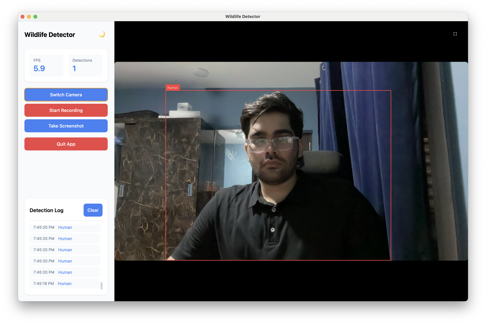
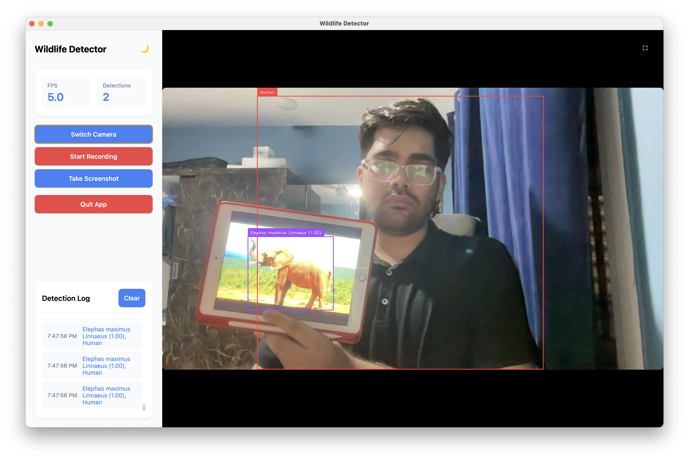

# Wildlife Detector 🦁

Real-time wildlife detection application using MegaDetector and computer vision, built with Electron and Python.



## ✨ Features
- 🎥 Real-time wildlife detection using MegaDetector v6
- 📸 Multi-camera support 
- 🎬 Video recording capability
- 📷 Screenshot functionality
- 🌓 Dark/Light mode interface
- 📊 Real-time detection statistics

## 🚀 Quick Start

### Prerequisites
- Node.js and npm
- Python 3.9+
- Anaconda or Miniconda

### Installation Steps

1. **Clone the repository**
   ```bash
   git clone https://github.com/Yash-Shindey/wildlife-detector.git
   cd wildlife-detector
   
2.	**Install Node dependencies**
   ```
  	npm install
   ```
3. **Set up Python environment**
```
   # Create conda environment
conda create -n wildlife-env python=3.9
conda activate wildlife-env

# Install required packages
pip install opencv-python
pip install torch torchvision torchaudio
pip install supervision
pip install pillow 
pip install transformers
```
4. **Run the application**
   ```
   npm start
   ```
## 💡Usage

- Feature	Description
- Switch Camera	Toggle between available cameras
- Start Recording	Capture video with detection overlays
- Take Screenshot	Capture the current frame
- Dark/Light Mode	Toggle using moon/sun icon
- Stats Panel	View real-time FPS and detection counts
- Detection Log	History of all detections


## 🛠️ Technical Details
### Project Structure
```
wildlife-detector/
├── config/
│   └── Info.plist
├── public/
│   └── index.html
├── src/
│   ├── detector.py   # Main detection logic
│   ├── main.js       # Electron main process
│   └── models/       # MegaDetector models
├── recordings/       # Saved recordings
└── screenshots/      # Saved screenshots
```


## Model Information

This application uses MegaDetector v6 from Microsoft’s CameraTraps repository for wildlife detection, combined with a species classifier for more detailed animal identification.

System Requirements

	- OS: Windows/macOS/Linux
	- RAM: 4GB minimum (8GB recommended)
	- Storage: 500MB for installation
	- Camera: Built-in or USB webcam

## 📋 Environment Setup

### Detailed Python Setup
	
 1.	Create and activate environment
    ```
       conda create -n wildlife-env python=3.9
       conda activate wildlife-env
    ```

2.	Install core packages

   ```
    # CPU Version
    pip install torch torchvision torchaudio
    pip install opencv-python supervision pillow transformers

    # GPU Version (if NVIDIA GPU available)
    pip3 install torch torchvision torchaudio --index-url https://download.pytorch.org/whl/cu118
   ```

## Common Issues

Camera Access

	•	Ensure camera permissions are granted
	•	Close other applications using the camera
	•	Try different camera indices if multiple cameras exist
	•	On macOS, grant terminal camera permissions

PyTorch Installation

	•	Match CUDA version with PyTorch installation for GPU support
	•	CPU version works on all systems but may be slower
	•	For M1/M2 Macs, use the default PyTorch installation

## 🔧 Development

### Building from Source
```
# Install development dependencies
npm install --save-dev electron

# Run in development mode
npm run dev

# Build for your platform
npm run buildng
```

### Debug Mode
	•	Mac: Press Cmd+Option+I
	•	Windows/Linux: Press Ctrl+Shift+I
	•	Check terminal for Python backend logs
	•	See browser console for frontend logs

## 🤝 Contributing

Contributions are welcome! Please feel free to submit a Pull Request.

## 📝 License

This project uses the MegaDetector model from Microsoft’s CameraTraps repository.

## 🙏 Credits
	•	MegaDetector model from Microsoft’s CameraTraps repository
	•	Built using Electron and Python
	•	Detection powered by PyTorch
